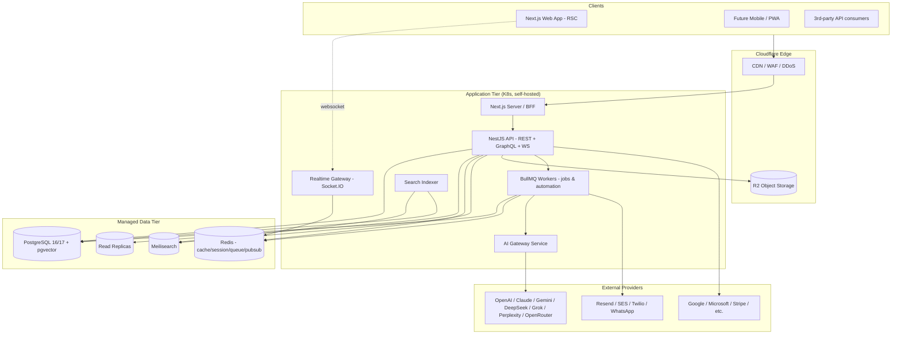
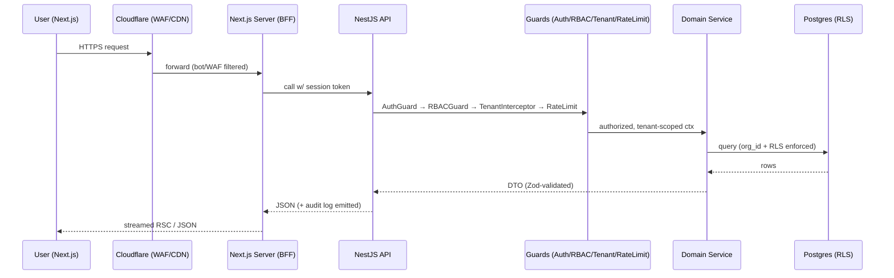
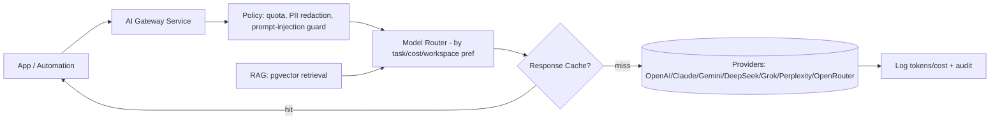

# 04 · System Architecture

> Deliverable 5. The high-level architecture, multi-tenancy model, service decomposition, and cross-cutting concerns. Diagrams are in Mermaid so they render in GitHub/most viewers.

---

## 1. Architecture style

**Modular monolith first, service-extraction later.** A funded team can move fastest with one deployable NestJS application organized into strict domain modules with clean boundaries, extracting only the domains that genuinely need independent scaling (Search, Automation/Jobs, AI, Realtime, Notifications) into separate services as load demands.

**Why not microservices from day one?** Premature service boundaries create distributed-systems tax (network failures, eventual consistency, deploy complexity) before we understand the domain. The modular monolith gives us clean seams so extraction is cheap when justified.



---

## 2. Multi-tenancy model

**The single most important foundational decision.** We serve one agency org that itself manages many *clients/customers*, plus (as SaaS) potentially many agency orgs.

**Model: shared database, shared schema, row-level tenancy** with a mandatory `organization_id` (tenant key) on every tenant-scoped table, enforced by:

1. **Application layer:** a Prisma middleware / NestJS request-scoped tenant context that injects `organization_id` into every query. No query leaves without it.
2. **Database layer (defense in depth):** PostgreSQL **Row-Level Security (RLS)** policies keyed on a session variable (`app.current_org`), so even a bug in the app layer can't leak cross-tenant data.
3. **Cache/search layer:** all Redis keys and Meilisearch indexes are namespaced by tenant.

**Hierarchy inside a tenant:**
```
Organization (agency / SaaS tenant)
 └─ Offices (locations)
     └─ Departments (Sales, SEO, PPC, Content, Dev, Design, Accounts, HR, Support, Mgmt)
         └─ Teams
             └─ Users (employees) — belong to teams, have roles
 └─ Customers/Clients (the agency's clients)
     └─ Contacts, Deals, Projects, SEO campaigns, Invoices...
```

**Why row-level over schema-per-tenant or DB-per-tenant?**
- 100k customers live *inside* one agency tenant → they are data rows, not tenants.
- Agency orgs (SaaS tenants) number in the hundreds/thousands → schema-per-tenant becomes a migration nightmare at that count; row-level + RLS scales cleanly and keeps ops simple.
- We reserve **DB-per-tenant** as an option for a few whale enterprise customers demanding data isolation (documented in scaling doc).

---

## 3. Domain modules (bounded contexts)

Each is a NestJS module with its own controllers, services, DTOs, and Prisma access. Cross-module calls go through service interfaces, never direct table reads.

| Context | Modules |
|---|---|
| **Identity & Access** | Auth, Users, Roles/Permissions, Sessions/Devices, Organizations, Offices, Departments, Teams |
| **CRM Core** | Leads, Customers/Contacts, Companies, Deals/Pipeline, Activities/Timeline, Notes, Tags |
| **Delivery** | Projects, Tasks, Milestones, Time/Attendance, Assets, Inventory |
| **Marketing/SEO** | SEO Projects, Keyword/Rank Tracking, Backlinks, Site Audits, Competitor Analysis, Content Planner/Calendar, Social Planner, Campaigns, Email/WhatsApp Marketing, Lead Forms, Landing Pages |
| **Finance** | Invoices, Payments, Subscriptions, Contracts, Commission |
| **Collaboration** | Chat (client + internal), Meetings, Calendar, Announcements, Knowledge Base, Documents |
| **Support** | Tickets, SLA, Knowledge Base |
| **Automation** | Workflow Builder, Triggers, Actions, Conditions, Scheduler, Webhooks |
| **AI** | AI Gateway, RAG/Embeddings, Assistants, Lead Scoring, Summaries, Insights |
| **Platform** | Notifications, Search, Files/Storage, Audit Logs, Integrations, API Management, Settings, Reports/Analytics, Goals/Performance |

---

## 4. Request lifecycle & cross-cutting concerns



**Cross-cutting (NestJS interceptors/guards/pipes):**
- **AuthGuard** — validates session/JWT, loads user + org context.
- **TenantInterceptor** — sets `app.current_org` for RLS + Prisma middleware filter.
- **RbacGuard** — checks permission matrix (`resource:action` + scope).
- **ValidationPipe (Zod)** — every input validated; shared schemas with frontend.
- **RateLimitGuard** — Redis token-bucket per user/org/route.
- **AuditInterceptor** — writes immutable audit log for mutating actions.
- **IdempotencyInterceptor** — idempotency keys for POST/webhooks.
- **Serialization** — DTO whitelisting so internal fields never leak.

---

## 5. Realtime architecture

- **Socket.IO gateway** (own pods, horizontally scaled) with the **Redis adapter** for cross-node broadcast.
- **Channels:** `org:{id}`, `user:{id}`, `resource:{type}:{id}` (e.g. a deal, a chat thread).
- **Events:** notifications, activity feed, presence, typing indicators, live dashboard metrics, chat messages, collaborative cursors.
- **Delivery guarantees:** at-least-once via Redis streams for critical events; UI is idempotent (dedupe by event id).
- Sticky sessions at the LB or use the Redis adapter to avoid stickiness requirements.

---

## 6. Background processing & the automation engine

- **BullMQ** queues on Redis, dedicated **worker pods** (separate deploy, autoscaled by queue depth).
- Queue families: `email`, `sms`, `whatsapp`, `webhooks`, `ai`, `reports`, `search-index`, `automation`, `imports`, `exports`, `scheduled`.
- **Retries** with exponential backoff + dead-letter queue; per-queue concurrency and rate limits.
- The **workflow engine** compiles a visual automation (trigger → conditions → actions → delays) into a job graph; long-running/branching flows can graduate to **Temporal** (durable execution) when complexity warrants. Details in [`06-workflow-automation.md`](06-workflow-automation.md).

---

## 7. AI gateway architecture



- **Per-workspace provider + key selection** (BYO-key supported); default platform key with quotas.
- **Model router:** cheap model first, escalate on need; task→model mapping (e.g. summaries → small model, content → large).
- **RAG:** workspace documents/notes/KB embedded into `pgvector`; retrieval augments prompts.
- **Guardrails:** PII redaction, prompt-injection defenses (treat retrieved content as untrusted), per-org quotas, full token/cost accounting, audit of every AI action.

---

## 8. Environments & data flow

| Env | Purpose | Data |
|---|---|---|
| **local** | Docker Compose (PG, Redis, Meili, MinIO/R2-compat, MailHog) | seeded fake data |
| **preview** | Per-PR ephemeral | disposable |
| **staging** | Prod-like, integration + E2E | anonymized/synthetic |
| **production** | Live, multi-AZ | real, encrypted, backed up |

---

## 9. Key architectural principles

1. **Tenant isolation is enforced at two layers** (app + RLS). Non-negotiable.
2. **Every mutation is audited.** Immutable, append-only audit log.
3. **Validation at the edge** with shared Zod schemas — no trust in client input.
4. **Idempotency** on all external-facing writes and webhooks.
5. **Read/write split** — replicas for reports/dashboards, primary for writes.
6. **Cache-aside** for hot reads; explicit invalidation on write.
7. **Everything observable** — traces/metrics/logs with tenant + request correlation IDs.
8. **Fail safe, degrade gracefully** — a down AI provider or integration must not take down the CRM.
9. **Extractable seams** — modules communicate via interfaces so services can be split out later.

See [`19-scaling-strategy.md`](19-scaling-strategy.md) for how each layer scales from Stage A→C.
