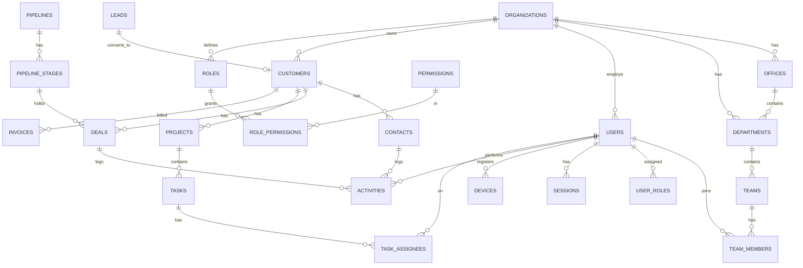
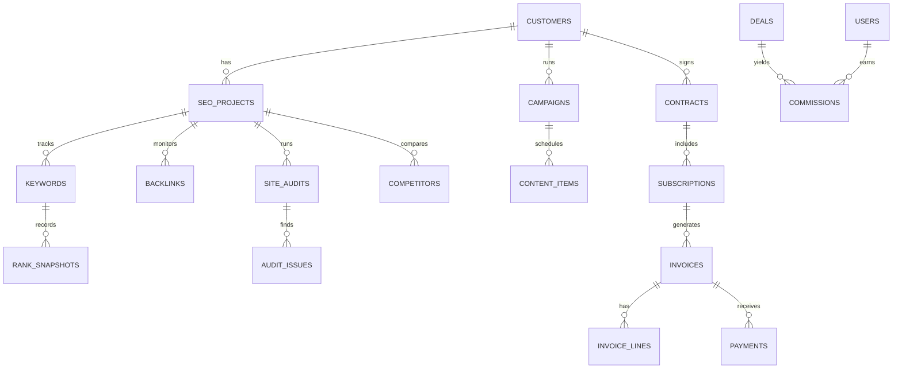
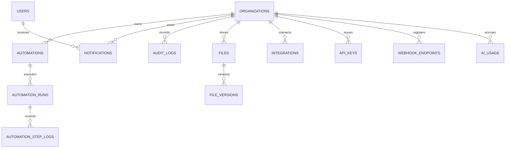

# 05 · Database Design & ER Diagram

> Deliverable 6. Normalized schema, core ERD, relationships, indexing, partitioning, and optimization strategy for PostgreSQL at 100k-customer / 1,000-employee scale.

---

## 1. Conventions

- **Every tenant-scoped table has `organization_id`** (FK → `organizations.id`) + a composite index leading with it. RLS policies key on it.
- **Primary keys:** `id` as **UUID v7** (time-ordered → index locality without exposing counts). 
- **Timestamps:** `created_at`, `updated_at` (UTC, `timestamptz`), soft delete via `deleted_at` where needed.
- **Money:** `numeric(18,4)` + explicit `currency` (never floats).
- **Enums:** Postgres enums for stable sets; lookup tables for tenant-configurable sets (e.g. pipeline stages, statuses).
- **JSONB** for flexible/custom fields, with GIN indexes; typed columns for anything queried/filtered hot.
- **Naming:** snake_case, plural tables, singular columns.

---

## 2. Core ER diagram (identity + CRM core)



## 3. Marketing/SEO & finance ERD (excerpt)



## 4. Platform ERD (excerpt)



---

## 5. Key tables (representative DDL sketches)

> Sketches, not final migrations — they show columns, types, keys, and indexes. Prisma schema is the source of truth once we build.

```sql
-- Tenancy root
CREATE TABLE organizations (
  id            uuid PRIMARY KEY DEFAULT uuidv7(),
  name          text NOT NULL,
  slug          citext UNIQUE NOT NULL,
  plan          text NOT NULL DEFAULT 'trial',
  settings      jsonb NOT NULL DEFAULT '{}',
  created_at    timestamptz NOT NULL DEFAULT now(),
  updated_at    timestamptz NOT NULL DEFAULT now(),
  deleted_at    timestamptz
);

CREATE TABLE users (
  id              uuid PRIMARY KEY DEFAULT uuidv7(),
  organization_id uuid NOT NULL REFERENCES organizations(id),
  email           citext NOT NULL,
  full_name       text NOT NULL,
  status          text NOT NULL DEFAULT 'active',
  department_id   uuid REFERENCES departments(id),
  office_id       uuid REFERENCES offices(id),
  mfa_enabled     boolean NOT NULL DEFAULT false,
  last_active_at  timestamptz,
  created_at      timestamptz NOT NULL DEFAULT now(),
  updated_at      timestamptz NOT NULL DEFAULT now(),
  deleted_at      timestamptz,
  UNIQUE (organization_id, email)
);
CREATE INDEX idx_users_org ON users (organization_id) WHERE deleted_at IS NULL;

-- RBAC
CREATE TABLE roles (
  id uuid PRIMARY KEY DEFAULT uuidv7(),
  organization_id uuid REFERENCES organizations(id), -- null = system role
  key text NOT NULL, name text NOT NULL, is_system boolean DEFAULT false,
  UNIQUE (organization_id, key)
);
CREATE TABLE permissions (
  id uuid PRIMARY KEY DEFAULT uuidv7(),
  resource text NOT NULL, action text NOT NULL, -- e.g. ('deal','update')
  UNIQUE (resource, action)
);
CREATE TABLE role_permissions (
  role_id uuid REFERENCES roles(id),
  permission_id uuid REFERENCES permissions(id),
  scope text NOT NULL DEFAULT 'org', -- org | department | team | own
  PRIMARY KEY (role_id, permission_id)
);
CREATE TABLE user_roles (
  user_id uuid REFERENCES users(id),
  role_id uuid REFERENCES roles(id),
  PRIMARY KEY (user_id, role_id)
);

-- CRM
CREATE TABLE customers (
  id uuid PRIMARY KEY DEFAULT uuidv7(),
  organization_id uuid NOT NULL REFERENCES organizations(id),
  name text NOT NULL, type text, status text NOT NULL DEFAULT 'active',
  owner_id uuid REFERENCES users(id),
  industry text, website text, custom jsonb NOT NULL DEFAULT '{}',
  created_at timestamptz DEFAULT now(), updated_at timestamptz DEFAULT now(),
  deleted_at timestamptz
);
CREATE INDEX idx_customers_org_status ON customers (organization_id, status);
CREATE INDEX idx_customers_custom_gin ON customers USING gin (custom);

CREATE TABLE deals (
  id uuid PRIMARY KEY DEFAULT uuidv7(),
  organization_id uuid NOT NULL REFERENCES organizations(id),
  customer_id uuid REFERENCES customers(id),
  pipeline_id uuid NOT NULL, stage_id uuid NOT NULL,
  title text NOT NULL, value numeric(18,4), currency text DEFAULT 'USD',
  probability int, owner_id uuid REFERENCES users(id),
  expected_close date, status text DEFAULT 'open',
  created_at timestamptz DEFAULT now(), updated_at timestamptz DEFAULT now()
);
CREATE INDEX idx_deals_org_stage ON deals (organization_id, stage_id);
CREATE INDEX idx_deals_org_owner ON deals (organization_id, owner_id);

-- Activity timeline (high-volume → partition by month)
CREATE TABLE activities (
  id uuid DEFAULT uuidv7(),
  organization_id uuid NOT NULL,
  actor_id uuid, subject_type text NOT NULL, subject_id uuid NOT NULL,
  verb text NOT NULL, meta jsonb NOT NULL DEFAULT '{}',
  created_at timestamptz NOT NULL DEFAULT now()
) PARTITION BY RANGE (created_at);
CREATE INDEX idx_activities_subject ON activities (organization_id, subject_type, subject_id, created_at DESC);

-- Audit log (append-only, partitioned by month)
CREATE TABLE audit_logs (
  id uuid DEFAULT uuidv7(),
  organization_id uuid NOT NULL,
  actor_id uuid, action text NOT NULL, resource text, resource_id uuid,
  ip inet, user_agent text, before jsonb, after jsonb,
  created_at timestamptz NOT NULL DEFAULT now()
) PARTITION BY RANGE (created_at);

-- RAG embeddings
CREATE TABLE embeddings (
  id uuid PRIMARY KEY DEFAULT uuidv7(),
  organization_id uuid NOT NULL,
  source_type text NOT NULL, source_id uuid NOT NULL,
  chunk text NOT NULL, embedding vector(1536),
  created_at timestamptz DEFAULT now()
);
CREATE INDEX idx_embeddings_ann ON embeddings USING hnsw (embedding vector_cosine_ops);
```

---

## 6. Indexing strategy

- **Tenant-leading composite indexes** on every hot query path: `(organization_id, <filter>, <sort>)`.
- **Partial indexes** excluding soft-deleted rows (`WHERE deleted_at IS NULL`).
- **GIN** indexes on `jsonb` custom fields and array/tag columns; GIN/`tsvector` for FTS fallback.
- **HNSW** (pgvector) for ANN semantic search.
- **BRIN** on append-only time-series (activities, audit, rank_snapshots) once partitioned.
- **Covering indexes** (`INCLUDE`) for the most frequent dashboard reads.
- Monitor with `pg_stat_statements`; drop unused indexes (write cost).

## 7. Partitioning & high-volume tables

Tables that grow without bound get **range partitioning by month** (managed with `pg_partman`):
- `activities`, `audit_logs`, `notifications`, `rank_snapshots`, `ai_usage`, `automation_runs`, `webhook_deliveries`, `email_events`.

Old partitions are detached → archived to R2/cold storage → dropped per retention policy.

## 8. Read/write split & pooling

- **PgBouncer** (transaction pooling) in front of Postgres — essential at 1,000 concurrent users.
- **Read replicas** for reports, analytics, dashboards, search reindex, exports.
- Writes → primary; the app routes read-only queries to replicas via a Prisma/driver read-replica config.

## 9. Optimization principles

1. **N+1 killers:** batch/`dataloader` for GraphQL; `include`/joins in Prisma deliberately.
2. **Keyset pagination** (not OFFSET) for large lists.
3. **Materialized views** for expensive report aggregates, refreshed via jobs.
4. **Denormalize deliberately** for read-hot counters (e.g. `deals_count` on customer) kept consistent by triggers/jobs.
5. **Avoid `SELECT *`** — DTO projections only.
6. **Connection budget** governed by PgBouncer; workers have separate pools.
7. **Every migration reviewed** for lock impact (use `CREATE INDEX CONCURRENTLY`, avoid long table rewrites).

## 10. Data lifecycle, backup & compliance

- **Backups:** automated managed snapshots + **PITR** (point-in-time recovery); cross-region copies for DR.
- **Retention:** configurable per data class; audit logs retained per compliance (e.g. 1–7 yrs), archived to cold storage.
- **GDPR:** per-subject export + delete tooling; `deleted_at` soft-delete then hard-purge job; PII columns flagged in a data catalog and encrypted at rest (column-level for the most sensitive).
- **Encryption:** at rest (managed DB + disk), in transit (TLS everywhere), column-level (pgcrypto/app-layer) for secrets/tokens.

Full ERD expands per module in the implementation phase; the Prisma schema will be the canonical, versioned source of truth. Next: [`06-workflow-automation.md`](06-workflow-automation.md).
