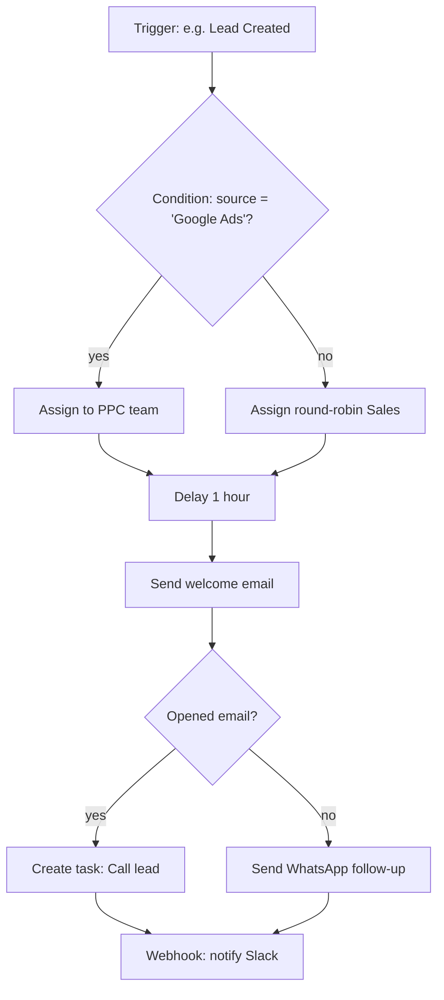
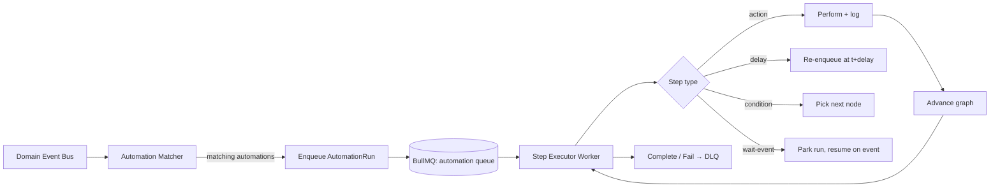

# 06 · Workflow & Automation Engine

> Deliverable 7. The visual automation builder, execution model, and job/queue design. This is a core differentiator (matching/beating Monday recipes, HubSpot workflows, GHL automations).

---

## 1. Concept

A **workflow** is a directed graph: **Trigger → (Conditions / Branches) → Actions**, with **Delays**, **Webhooks**, and **Schedulers**. Users build it via drag-and-drop; we compile it to an executable definition and run it on durable infrastructure.

---

## 2. Building blocks

### Triggers (what starts a flow)
- **Record events:** created / updated / deleted / field-changed / stage-changed (lead, deal, customer, task, project, invoice, ticket…).
- **Time-based:** scheduled (cron), relative-to-date (e.g. "3 days before contract renewal").
- **Inbound:** incoming webhook, form submission, email received, chat message, payment received.
- **SEO/marketing:** rank change threshold, new backlink, audit issue detected, campaign milestone.
- **Manual:** run-on-demand / button on a record.

### Conditions & logic
- **IF / ELSE / ELSE-IF** branches; **AND/OR** groups; comparison operators; field-to-field and field-to-value; "is empty", "changed from/to", time windows.
- **Filters** short-circuit a flow (stop if not matched).

### Actions
- CRM: create/update record, assign owner, change stage, add tag, add note, create task/project.
- Comms: send email / SMS / WhatsApp / Telegram / Slack / Teams / push / in-app notification.
- AI: generate content, summarize, score lead, classify, extract — via the AI gateway.
- Integration: call external API, sync to Google/Microsoft/Stripe/etc., send webhook.
- Flow control: **delay** (fixed or until date/condition), **wait-for-event**, goto/branch, sub-workflow.
- Data: HTTP request, transform, set variable, math/format.

### Utilities
- **Webhook (out):** signed POST with retry.
- **Scheduler:** cron + timezone-aware.
- **Variables & context:** the triggering record + accumulated step outputs are available to later steps via a templating syntax (`{{deal.value}}`).

---

## 3. Execution model

- **Event bus:** domain services emit events (`lead.created`, `deal.stage_changed`) to an internal bus (in-process → Redis streams when extracted).
- **Matcher:** finds active automations whose trigger matches; creates an `automation_run`.
- **Step executor:** processes one node at a time; each step is a job → idempotent, retryable, logged.
- **Delays & waits:** implemented as **delayed jobs** (BullMQ delay) or **parked runs** resumed by a later event — no busy-waiting.
- **Durability:** for simple/short flows, BullMQ suffices. For **long-running, human-in-the-loop, or complex branching** flows, graduate the engine to **Temporal** (durable execution, versioned workflows, automatic retries, exactly-once step semantics). The engine is abstracted so we can move without rewriting user automations.

---

## 4. Data model (see [`05-database-design.md`](05-database-design.md))

- `automations` — definition (JSON graph), trigger config, status, version.
- `automation_versions` — immutable published versions (edits create new versions; running instances pin their version).
- `automation_runs` — one per execution: status, context snapshot, current node, timings.
- `automation_step_logs` — per-step input/output/result/error (for the run inspector UI).

## 5. Reliability & safety

- **Retries:** exponential backoff per step; **dead-letter queue** + alerting on terminal failure.
- **Idempotency:** each step keyed so re-delivery doesn't double-act (e.g. don't send the same email twice).
- **Loop/recursion guards:** max steps per run, max runs per record per window, detect automation-triggering-automation cycles.
- **Rate limits:** per-org action budgets (esp. email/SMS/AI) to prevent runaway costs.
- **Dry-run / test mode:** simulate a flow against a sample record without side effects.
- **Versioning:** editing a live automation publishes a new version; in-flight runs finish on their pinned version.
- **Observability:** every run is inspectable step-by-step in the UI; metrics on run volume, failure rate, latency; traces via OTel.
- **Kill switch:** pause an automation or all automations for an org instantly.

## 6. Background job families (BullMQ)

| Queue | Purpose | Concurrency/notes |
|---|---|---|
| `automation` | workflow step execution | high, autoscaled by depth |
| `email` / `sms` / `whatsapp` | outbound comms | rate-limited per provider |
| `ai` | AI generation/scoring/summaries | quota-aware, cost-tracked |
| `webhooks` | outbound webhook delivery | signed, retried, DLQ |
| `search-index` | Meilisearch/embedding sync | debounced |
| `reports` / `exports` | heavy aggregation, file gen | replica reads |
| `imports` | CSV/API bulk import | chunked, resumable |
| `scheduled` | cron triggers, renewals, digests | timezone-aware |
| `integrations-sync` | Google/MS/Stripe sync | backoff on 429 |

All queues: exponential backoff, DLQ, metrics (depth, latency, failure rate), alert thresholds.

## 7. Templates & marketplace (future)

- **Snapshots** (à la GoHighLevel): package a set of pipelines, automations, and templates a new client can be provisioned with in one click.
- **Automation template library** per department (Sales follow-up, SEO onboarding, invoice-overdue chase, etc.).

Next: [`07-api-design.md`](07-api-design.md).
